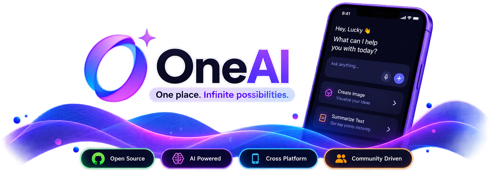

# ✨ OneAI

### An open-source AI platform built to bring powerful AI capabilities into one beautiful, extensible experience.

<p align="center">
  
</p>

<p align="center">
  <b>One platform. Multiple AI capabilities. Built by the community.</b>
</p>

<p align="center">


</p>

---

# 🚀 What is OneAI?

**OneAI** is an open-source AI platform designed to bring different AI-powered capabilities together into a single, modern and intuitive application.

The goal is simple:

> **Make AI unified, accessible, extensible, and community-driven.**

Instead of building isolated AI tools, OneAI aims to provide a unified platform where users can interact with AI, organize their work, manage projects, and eventually extend the platform with new capabilities. Simply, users don't need to have 'n' no. of AI apps to manage there work there can be one AI app that will handle all the things.

The project is being built with a strong focus on:

* 🧩 Modular architecture
* 🔗 Unified solution
* 🎨 Beautiful and consistent UI
* ⚡ Performance
* 🔐 Security
* 🔌 API-driven architecture
* 🌍 Open-source collaboration
* 🚀 Community-driven features

---

# 💡 Why OneAI?

AI is evolving rapidly, but many AI experiences are fragmented across different applications and platforms.

OneAI aims to provide a **single foundation** that developers can build upon.

Whether you want to:

* Build a new AI-powered feature
* Combine different features
* Experiment with a new AI model
* Improve the existing UI
* Add a new integration
* Improve performance
* Contribute to the backend
* Build developer tooling

**OneAI is designed to make that possible.**

---

# ✨ Features

### 💬 AI Chat

Interact with AI through a clean and modern conversational interface.

* Continuous conversations
* Prompt editing
* Message actions
* Copy responses
* Regenerate responses
* Feedback actions
* Rich conversation experience

### 📁 Projects

Organize conversations and AI-related work into projects.

* Create projects
* Manage projects
* Organize AI interactions
* Project-based workflows

### 👤 User Profile

Manage your OneAI account from a centralized profile experience.

* Account information
* Subscription management
* Security settings
* Data & privacy
* Connected accounts

### 🎨 Modern UI

OneAI follows a consistent design system with a focus on simplicity and usability.

* Light mode
* Dark mode
* Reusable components
* Consistent spacing and typography
* Modern animations
* Responsive layouts

### 🧩 Modular Architecture

The application is structured to make it easier for developers to understand, modify and extend the project.

---

# 🛠️ Tech Stack

## Frontend

| Technology    | Purpose                            |
| ------------- | ---------------------------------- |
| **Flutter**   | Cross-platform application         |
| **Dart**      | Application development            |
| **Stacked**   | MVVM architecture                  |
| **Firebase**  | Authentication / platform services |
| **REST APIs** | Backend communication              |

## Backend

| Technology     | Purpose                     |
| -------------- | --------------------------- |
| **NestJS**     | Backend framework           |
| **Node.js**    | Runtime                     |
| **PostgreSQL** | Database                    |
| **Supabase**   | Database / backend services |
| **REST API**   | Client-server communication |

## Development

| Tool                     | Purpose         |
| ------------------------ | --------------- |
| Git                      | Version control |
| GitHub                   | Collaboration   |
| Postman                  | API testing     |
| VS Code / Android Studio | Development     |
| Xcode                    | iOS development |

---

# 🏗️ Architecture

OneAI follows a modular architecture designed to keep the application maintainable as the project grows.

```text
                         ┌──────────────────────┐
                         │       OneAI App      │
                         │      Flutter         │
                         └──────────┬───────────┘
                                    │
                                    │ REST API
                                    ▼
                         ┌──────────────────────┐
                         │      OneAI API       │
                         │       NestJS         │
                         └──────────┬───────────┘
                                    │
                    ┌───────────────┼───────────────┐
                    │               │               │
                    ▼               ▼               ▼
              ┌──────────┐   ┌────────────┐   ┌────────────┐
              │PostgreSQL│   │ AI Services│   │  Storage   │
              └──────────┘   └────────────┘   └────────────┘
```

The architecture will continue evolving as new features and integrations are introduced.

---

# 📂 Project Structure

The repository is organized to keep different parts of the platform separated.

```text
OneAI/
│
├── mobile/
│   └── Flutter application
│
├── backend/
│   └── NestJS backend
│
├── docs/
│   └── Project documentation
│
├── assets/
│   └── Images and project assets
│
├── .gitignore
├── LICENSE
└── README.md
```

> The structure may evolve as the project grows and new modules are introduced.

---

# 🚧 Current Status

OneAI is currently under active development.

### Prototype

The initial prototype focuses on completing the application experience and validating the UI and navigation.

<p align="center"> <a href="https://github.com/LuckyVishwa1104/OneAI/releases/tag/v1.0.29-OneAI"> <b>✨ Explore the OneAI Prototype →</b> </a>  </p>

| Area                      | Status            |
| ------------------------- | ----------------- |
| UI Screens                | ✅ Complete        |
| Navigation                | ✅ Complete        |
| Design System             | ✅ Complete        |
| Mock Data                 | ✅ Available       |
| Chat UI                   | ✅ Available       |
| Projects UI               | ✅ Available       |
| Profile UI                | ✅ Available       |
| Subscription UI           | ✅ Available       |
| Backend                   | 🚧 In Development |
| REST API                  | 🚧 Planned        |
| Database Integration      | 🚧 Planned        |
| Authentication            | 🚧 Integration    |
| Production Release        | 🔜 Upcoming       |
| Open Source Contributions | 🔜 Upcoming       |

---

# 🗺️ Roadmap

OneAI is being developed incrementally.

### Phase 1 — Prototype

- 🟢 Application UI
- 🟢 Navigation
- 🟢 Design system
- 🟢 Chat interface
- 🟢 Projects interface
- 🟢 Profile
- 🟢 Subscription UI
- 🟢 Static mock data

### Phase 2 — Backend

- 🟡 NestJS backend
- 🟡 Database setup
- 🟡 User management
- 🟡 Authentication
- 🟡 Project APIs
- 🟡 Conversation APIs
- 🟡 AI service integration
- 🟡 Subscription APIs

### Phase 3 — API Integration

- 🟡 Replace mock data
- 🟡 Connect Flutter application with backend
- 🟡 Authentication flow
- 🟡 Persistent conversations
- 🟡 Persistent projects
- 🟡 Error handling
- 🟡 Loading states
- 🟡 Offline handling

### Phase 4 — Open Source

- 🟡 Contribution guidelines
- 🟡 Development documentation
- 🟡 Issue templates
- 🟡 Pull request templates
- 🟡 Developer onboarding
- 🟡 Community contribution workflow

### Phase 5 — Community Growth

- 🟡 New AI providers
- 🟡 Additional AI models
- 🟡 Plugin / extension system
- 🟡 Developer APIs
- 🟡 Community-driven features
- 🟡 Performance improvements
- 🟡 Advanced personalization

---

# 🤝 Contributing

OneAI is being built with the intention of becoming a **community-driven open-source project**.

We believe great software becomes better when developers with different ideas and experiences work together.

Once the project reaches its open-source milestone, contributors will be able to help with:

### 💻 Development

* Flutter development
* Backend development
* API development
* Database optimization
* AI integrations

### 🎨 Design

* UI/UX improvements
* Animations
* Accessibility
* Design system improvements

### 🧪 Quality

* Bug fixing
* Testing
* Performance optimization
* Security improvements

### 💡 Innovation

* New AI capabilities
* New integrations
* Developer tools
* Automation
* Community-requested features

Before submitting a contribution, please check the project's contribution guidelines and open issues.

---

# 🧑‍💻 Getting Started

## Prerequisites

Make sure you have the following installed:

* Flutter
* Dart
* Node.js
* npm
* Git
* Android Studio or Xcode

## Clone the repository

```bash
git clone https://github.com/<your-username>/OneAI.git

cd OneAI
```

## Flutter application

```bash
cd mobile

flutter pub get

flutter run
```

## Backend

```bash
cd backend

npm install

npm run start:dev
```

> Backend setup will be updated as the API architecture is finalized.

---

# 🌱 How You Can Help

Even if you are not ready to write code, there are many ways to contribute.

⭐ Star the repository

🐛 Report bugs

💡 Suggest features

📖 Improve documentation

🎨 Improve the UI/UX

🧪 Test new releases

💻 Submit pull requests

📢 Share the project

Every contribution matters.

---

# 📸 Screenshots

> Screenshots and product demonstrations will be added as the application reaches the next milestone.

<p align="center">


</p>

---

# 🔐 Security

Security is an important part of OneAI.

If you discover a security vulnerability, please **do not open a public issue**.

Instead, report it privately through the security contact provided in the repository.

More detailed security guidelines will be added before the public open-source release.

---

# 📜 License

OneAI is intended to be released as an open-source project.

The project currently uses the **Apache License 2.0**.

See [`LICENSE`](LICENSE) for the complete license text.

---

# 🌟 Support OneAI

If you like the idea behind OneAI, consider supporting the project.

### ⭐ Star the repository

A GitHub star helps others discover the project.

### 🐛 Report issues

Found something broken?

Open an issue and help us improve OneAI.

### 💡 Share ideas

Have an idea for a feature?

Start a discussion and share it with the community.

### 🤝 Contribute

Want to build something with us?

We'd love to have you involved.

---

# 🚀 Vision

OneAI is more than just another AI application.

The long-term vision is to create an **open platform where developers can build, experiment and contribute AI-powered experiences together.**

The project starts with a simple idea:

> **OneAI — One place for anything releated to AI.**

And the bigger goal is:

> **Build it together. Improve it together.**

---

<p align="center">

### ⭐ If you believe in the vision, consider starring the repository.

**Built with ❤️ by developers, for developers.**

</p>
